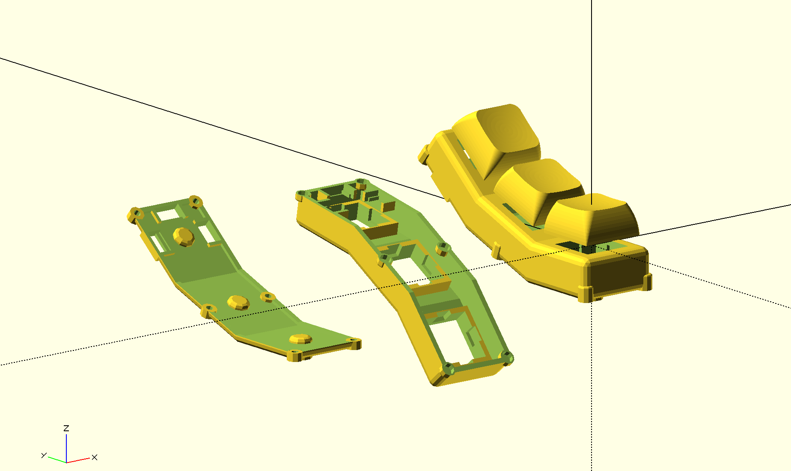

# keyboard-modules
3D models for modular ortholinear split keyboards, written with [SolidPython2](https://github.com/jeff-dh/SolidPython)



## Installation
* deps
    * python `3.11` (e.g. with asdf `asdf plugin add python; asdf install`)
    * pipenv (`pip install pipenv`)
    * `pipenv shell`
    * `pipenv install`

## Parts
### Column
A single key column. See `ColumnConf` in `src/column.py` for options. e.g.

```python
from column import ColumnConf
from key import ChocV1Switch, CherryMXSwitch, KailhLPCap, XDACap
from render import render

render(ColumnConf(
  angle=20,
  rows=5,
  between=3.5,
  switches=CherryMXSwitch,
  caps=XDACap,
  show_keys=True,
))
```