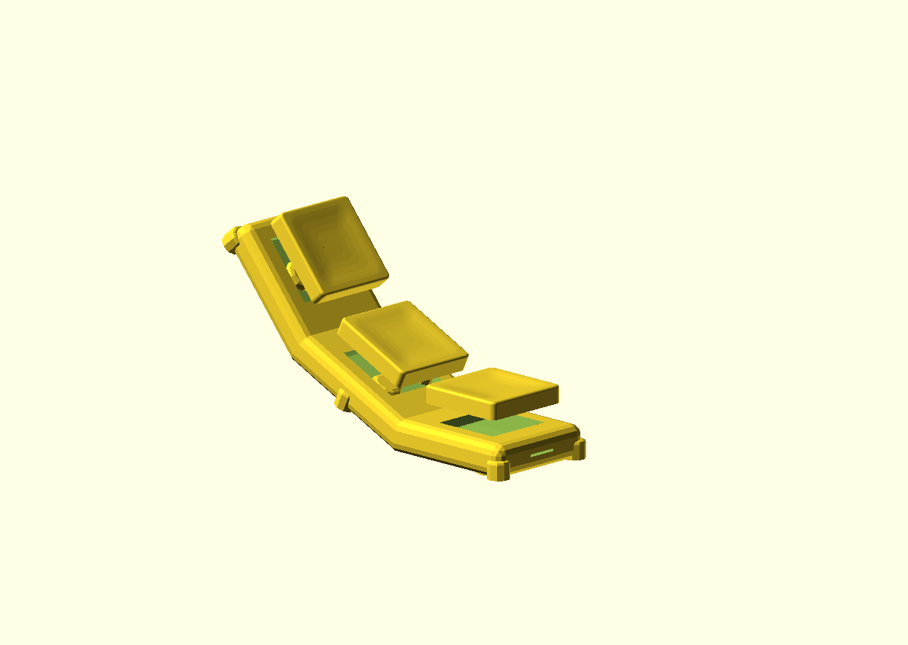
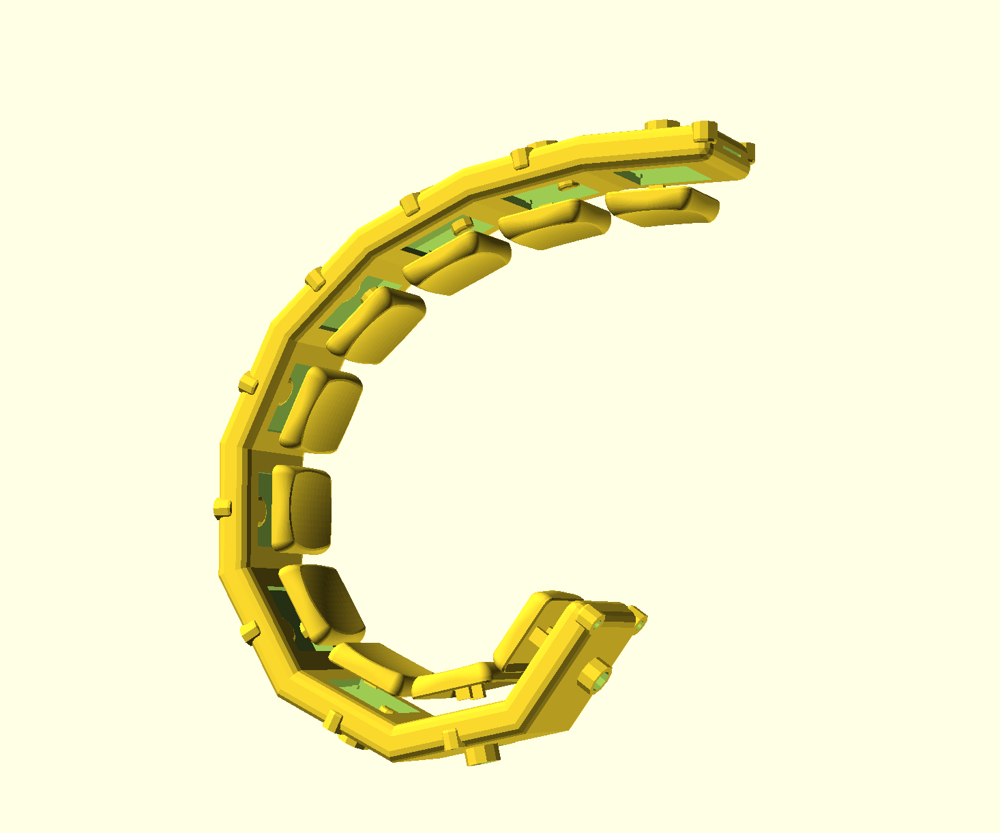
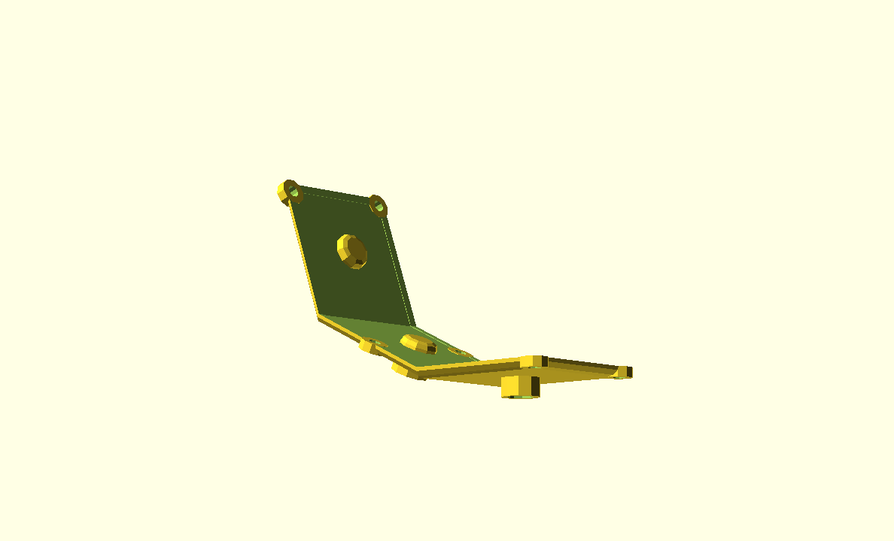
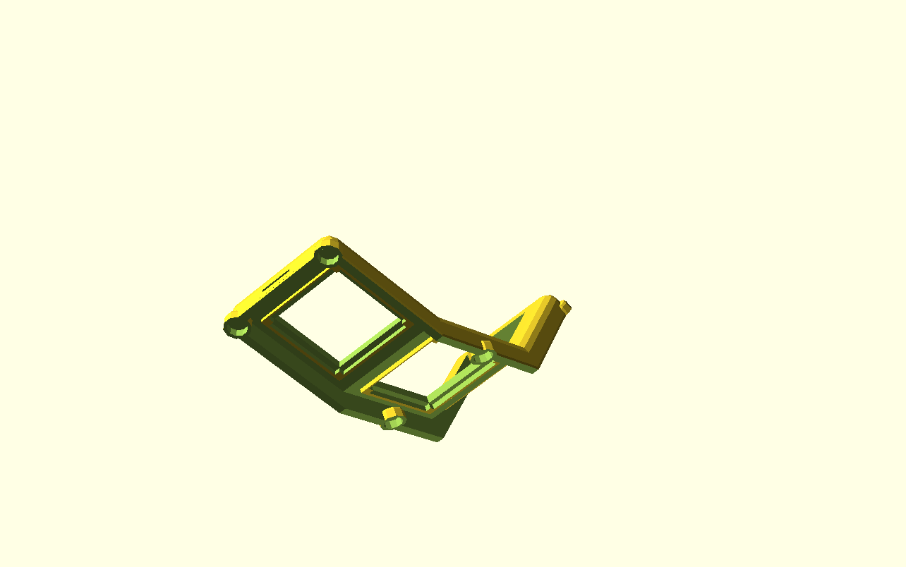

# keyboard-modules
3D models for modular ortholinear split keyboards, written with [skidl](https://github.com/devbisme/skidl) for circuitry schematics and [SolidPython2](https://github.com/jeff-dh/SolidPython) for 3D modeling.

Use as a library to generate configurable module models. Output format is `.scad`, or `.stl`.

## Installation
* deps
    * python `3.11` (e.g. with asdf `asdf plugin add python; asdf install`)
    * pipenv (`pip install pipenv`)
    * `pipenv shell`
    * `pipenv install`
    * for pcbs
      * ensure you have kicad >= 6 and pcbnew installed
      * add the [kiswitch](https://github.com/kiswitch/kiswitch) footprint library
      * create a `.env` file specifying `KICAD_SYMBOL_DIR`, e.g. `KICAD_SYMBOL_DIR=/Applications/KiCad/KiCad.app/Contents/SharedSupport/symbols/`

## Parts
### Column
A single key column of keys. See [ColumnConf](#ColumnConf) for full configuration options. e.g.

```python
from column import ColumnConf
from key import ChocV1Switch, KailhLPCap
from render import renderColumn

renderColumn(ColumnConf(
  angle=20,
  rows=5,
  between=3.5,
  switches=ChocV1Switch,
  caps=KailhLPCap,
  show_keys=True,
))
```



`angle` determines the curvature of the key column by defining the angle of rotation between each key. It also accepts an array of angles, or a function that takes the key index and returns the angle. e.g.

```python
...
renderColumn(ColumnConf(
  angle=lambda i : 30 - 4*(i - 3),
  rows=10,
  ...
))
```



`renderColumn(conf[, name])` writes 3 `scad` models to `out/`. `<name>` defaults to `column-r<rows>-a<angle>-<switches>`. The top and bottom are secured with machine screws through the bottom part and heat set inserts in the top part.
* `out/<name>.scad` is the full module, mostly for visual inspection purposes
* `out/<name>_bottom.scad` is the bottom part of the case
  
* `out/<name>_top.scad` is the top part of the case
  

## PCB
### Column
Flexible PCB for a single column. e.g.
```python
from schematic import Column
col = Column(5)
col.render()
```

Renders a netlist to `pcb/column/netlists/r5.net`

## Config

### `ColumnConf`
| Arg            | Type                     | Default      | Description |
|----------------|--------------------------|--------------|-------------|
| `rows`           | `int`                  | `3`            | number of keys in the column |
| `between`        | `number`               | `4`            | distance between the key and the edge of the case adjacent to the next key |
| `angle`          | `number\|list\|function` | `10`           | angle determines the curvature of the key column by defining the angle of rotation between each key. It also accepts an array of angle (must be length `rows-1`), or a function that takes the key index and returns the angle |
| `socket`         | `SocketConf`           | `None`         | use this to override key socket config. dimensions are automatically adjusted if `switches` is set, but some other options can be configured still |
| `hub_jst`        | `JSTConnectorConf`     | `None`         | if `column_connect=JSTConnector`, use this to configure the column-to-hub jst connector |
| `side_jst`       | `JSTConnectorConf`     | `None`         | if `column_connect=JSTConnector`, use this to configure the column-to-column jst connector |
| `case_connect`   | `HeatsetInsertConf`    | `None`         | for overriding config for the case mounting heat set used to connect the top and bottom of the case together |
| `case_mount`     | `HeatsetInsertConf`    | `None`         | for overriding config for the case mounting heat set inserts under each case section |
| `in_w`           | `number`               | `20`           | interior width of the case |
| `in_d`           | `number`               | `20`           | interior depth of each case section |
| `in_h`           | `number`               | `5`            | interior case height, unless more is needed to accommodate the `switches` |
| `round`          | `number`               | `2`            | radius of case corner rounding |
| `thick`          | `number`               | `1.5`          | thickness of the shell of the case |
| `top`            | `bool`                 | `True`         | whether to render the top of the case |
| `top_portion`    | `number`               | `.8`           | how far down the case to cut the case in two (0.0-1.0) |
| `switches`       | `KeySwitch class`      | `None`         | which key switches to accommodate in the sockets and case depth |
| `caps`           | `KeyCap class`         | `None`         | which key cap profile to render, if using show_keys |
| `show_keys`      | `bool`                 | `False`        | whether to render the key caps in the combined output |
| `column_connect` | `Connector class`      | `FPCConnector` | which type of connectors to use for connecting wiring of the columns |
| `fpc`            | `FPCConnectorConf`     | `None`         | include if `column_connect=FPCConnector` |

### `SocketConf`
| Arg        | Type                 | Default        | Description |
|------------|----------------------|----------------|-------------|
| `thick`    | `number`             | `4`            | thickness of keysocket. overridden if `switch` is set |
| `recess_w` | `number`             | `14`           | width of the recess the switch sits in. overridden if `switch` is set |
| `recess_d` | `number`             | `13.5`         | depth of the recess the swithc sits in. overridden if `switch` is set |
| `rim`      | `number`             | `1.5`          | width of the flat rim around the recess, where the overhang on the switch sits |
| `notch_z`  | `number`             | `-1.5`         | distance of the notches below the top of the socket |
| `notch_w`  | `number`             | `1`            | width of notches |
| `notch_d`  | `number`             | `5`            | depth of notches |
| `switch`   | `KeySwitch class`    | `None`         | which key switch to accommodate in the socket |

### `JSTConnectorConf`
| Arg      | Type     | Default   | Description |
|----------|----------|-----------|-------------|
| `pitch`  | `number` | `1.25`    | pitch between pins |
| `pins`   | `int`    | `4`       | number of pins |
| `w`      | `number` | `None`    | default calculated based on pitch and pins |
| `h`      | `number` | `4`       | height of the connector |
| `d`      | `number` | `3.5`     | depth of the connector |
| `ledge`  | `number` | `2`       | width of the ledge the connector sits on |
| `thick`  | `number` | `1`       | thickness of the walls around the connector socket |

### `FPCConnectorConf`
| Arg      | Type     | Default   | Description |
|----------|----------|-----------|-------------|
| `pitch`  | `number` | `1.25`    | pitch between pins |
| `pins`   | `int`    | `4`       | number of pins |
| `w`      | `number` | `None`    | default calculated based on pitch and pins |
| `h`      | `number` | `4`       | height of the slot for the fpc cable |
| `d`      | `number` | `3.5`     | depth of the slot for the fpc cable |
| `thick`  | `number` | `1`       | thickness of the walls around the slot for the fpc cable |

### `HeatsetInsertConf`
| Arg    | Type       | Default | Description |
|--------|------------|---------|-------------|
| `l`      | `number`     | `5`       | length of insert |
| `size`   | `ScrewSize`  | `M3`      | size of screws for the insert |
| `thick`  | `number`     | `.6`      | thickness of socket around insert |
| `capped` | `bool`       | `True`    | cap the socket around the insert |
| `round`  | `number`     | `1`       | radius of roundness of the socket cap |